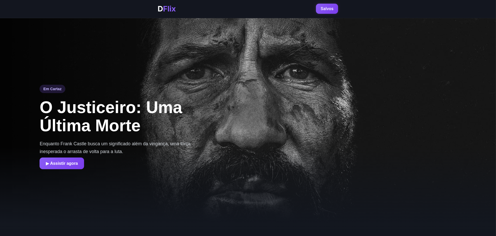

# Movie Explorer

Projeto prático desenvolvido para aprofundar conhecimentos em ReactJS, consumindo uma API externa de filmes e aplicando conceitos modernos do ecossistema frontend.

## Sobre o projeto

O objetivo deste projeto é praticar o desenvolvimento de aplicações utilizando ReactJS, explorando componentização, gerenciamento de estado, consumo de APIs REST e renderização dinâmica de informações.

A aplicação permite buscar filmes, visualizar detalhes e navegar por uma interface moderna e responsiva.

---

## Tecnologias utilizadas

- ReactJS
- JavaScript
- HTML5
- CSS3
- Axios / Fetch API
- API REST de filmes

---

## Conceitos praticados

- Componentização
- Hooks do React
- `useState`
- `useEffect`
- Consumo de APIs externas
- Manipulação de estados
- Renderização dinâmica
- Responsividade
- Estruturação de projetos React

---

## Funcionalidades

 Listagem de filmes  
 Busca de filmes por nome  
 Exibição de detalhes  
 Interface responsiva  
 Consumo de API externa  

---

## Preview



---

## Como executar o projeto

### Clone o repositório

```bash
git clone https://github.com/rckdemezio/d-flix.git
````

### Acesse a pasta do projeto

```bash
cd d-flix
```

### Instale as dependências

```bash
npm install
```

### Execute o projeto

```bash
npm start
```

O projeto será iniciado em:

```bash
http://localhost:3000
```

---

## API utilizada

Exemplo:

* The Movie Database (TMDB)
* OMDb API

---

## Finalidade

Este projeto possui fins educacionais e foi desenvolvido como prática para evolução no ecossistema ReactJS.

---

## Autor

Desenvolvido por Henrique Demézio 
